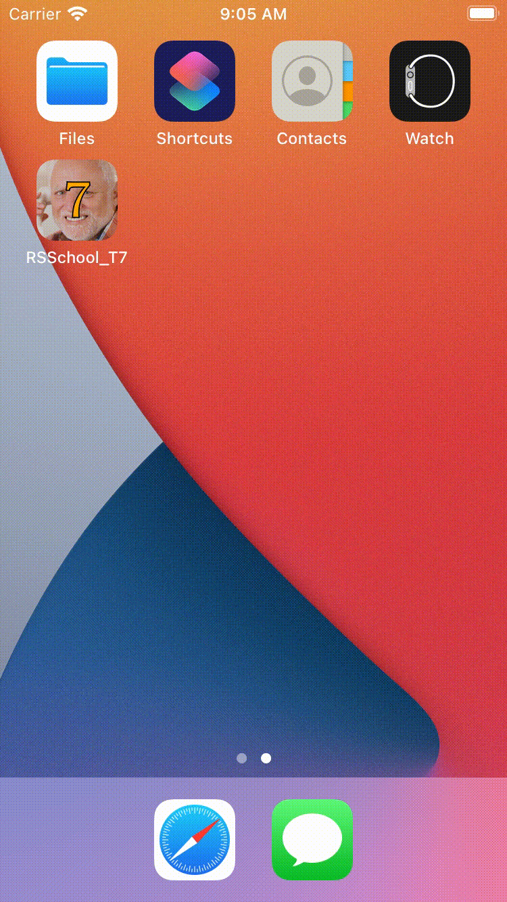

# Task 7

В этом задании необходимо разработать экран авторизации пользователя в приложение. Для реализации вам понадобятся знания об элементах пользовательского интерфейса: `UIView`, `CALayer`, `UIViewController`, `UITextField`, `UIButton`, `UILabel`, `UIAlertController`.

# Application flow

При запуске приложения пользователь попадает на экран авторизации. На экране расположены интерактивные элементы:

- поля ввода `login`, `password`
- кнопка  `authorize`

Также здесь расположен неинтерактивный текстовый элемент `text`.

Для того, чтобы пользователь смог войти в приложение, ему необходимо ввести значения в поля `login` и `password`. 

При нажатии на кнопку `authorize` значения в полях `login` и `password` проверяются на совпадение с имеющимися в системе значениями. Корректными являются следующие значения:

- для поля `login` - значение "*username*"
- для поля `password` - значение "*password*"

В случае неудачной проверки - несовпадение значений в полях с имеющимися в системе - отображается следующее состояние. Изменяют своё отображение только те поля, в которых оказалось некорректное значение. В случае, если в одном поле оказалось корректное значение, а в другом - некорректное, отображение меняет только поле с некорректным значением.

При возобновлении ввода в поле с некорректным значением оно возвращает своё отображение к базовому.

В случае удачной проверки - совпадение значений в обоих полях с имеющимися в системе - экран переходит в следующее состояние. Элементы управления `login`, `password` и `authorize` изменяют состояние на неактивное. На экране появляется поле `secure`, которое имеет активное состояние. Поле `secure` содержит три кнопки - `1`, `2`, `3` - и строку текста `result`. 

Пользователю нужно нажать кнопки `1`, `2` и  `3` в корректной последовательности, чтобы авторизоваться в приложении. Корректной последовательностью является следующая:

- `1` `3` `2`

Вводимая пользователем последовательность отображается в элементе

В случае, если пользователю ввёл некорректную последовательность, в элементе `secure` отображается индикация состояния `error`. Значение элемента `result` возвращается к исходному. 

Предел количества элементв в вводимой последовательности равен 3. Состояние `error` соответствует случаю, когда пользователь ввёл три значения последовательности и результат не совпал с корректным, записанным в системе.

Если пользователь начинает вводить последовательность, когда элемент `secure` находится в состоянии `error`, элемент `secure` переходит в состояние `ready`. 

Если пользователь ввёл корректную последовательность, элемент `secure` переходит в состояние `success`. На экране отображается модальное окно с заголовком "*Welcome*" и сообщением "*You are successfuly authorized!*". Интерактивная кнопка имеет заголовок "*Refresh*". 

При нажатии на интерактивную кнопку:

- модальное окно пропадает
- экран авторизации возвращается в базовое состояние

---

# Общие требования

- Приложение поддерживает только светлую тему
- Минимальная версия операционной системы: iOS 12
- Для реализации приложения необходимо использовать только Objective-C
- Для реализации пользовательского интерфейса можно:
    - использовать xib и storyboard
    - описывать элементы интерфейса в коде

# Иконка приложения

[Icons.zip](Task/Icons.zip)

Набор требуемых размеров иконки

# Цветовая схема приложения

# Элементы пользовательского интерфейса

## Фон

---

## Логотип

Текстовый элемент, содержит название приложения. Текст элемента: "*RSSchool*"

---

## Текстовые поля

Текстовые поля `login` и `password`. 

Поле `login` позволяет вводить только символы латинского алфавита. Ввод предлагается с нижнего начертания.

Поле `password` предназначено для ввода пароля. Значение, вводимое в это поле, экранируется.

Текстовое поле находится в одном из трёх состояний:

- `ready`
- `error`
- `success`

При нажатии на текстовое поле на экране появляется системная клавиатура. Необходимо реализовать возможности для её скрытия:

- при нажатии на кнопку "return" на клавиатуре последняя пропадает с экрана
- при нажатии на любое место экрана, кроме текстовых полей, клавиатура пропадает с экрана

Состояние `active`, поле активно

Состояние `error`, поле активно

Состояние `success`, поле неактивно

---

## Кнопка авторизации

Кнопка авторизации позволяет пользователю проверить корректность введённых данных и продолжить процесс авторизации. 

Для иконки пользователя используется элемент SF Symbols - `person` и `person.fill`.

Отображение кнопки может находиться в одном из трёх состояний:

- `default`
- `highlighted`
- `disabled`

`default` соответствует состоянию, в котором кнопка является интерактивной, но пользователь на неё не нажимает. 

`highlighted` - состояние, когда пользователь нажал на кнопку. Фоновый цвет кнопки меняется. Когда пользователь убирает палец с кнопки, она переходит в состояние `default`. 

Состояние `disabled` соответствует тому, при котором кнопка является неинтерактивной. Любые взаимодействия пользователя с ней не приводят к изменениям в её отображении.

Состояние `default`, кнопка активна

Состояние `default`, кнопка активна

Состояние `default`, кнопка активна

Состояние `highlighted`, кнопка активна

Состояние `disabled`, кнопка неактивна

---

## Поле дополнительной проверки

Поле `secure` содержит в себе три интерактивных элемента `1`, `2`, `3` и текстовый элемент `result`. Пользователь поочерёдно нажимает интерактивные элементы `1`, `2`, `3`, а в `result` отображается вводимая последовательность в виде чисел, соответствующих нажимаемым элементам.

Поле `secure` может находиться в одном из трёх состояний:

- `default`
- `error`
- `success`

В состоянии `default` интерактивные элементы `1`, `2`, `3` активны, граница поля `secure` не отображается. 

В состоянии `error` у поля `secure` отображается граница соответствующего цвета. Когда `secure` находится в состоянии `error` и пользователь начинает ввод последовательности, поле `secure` переходит в состояние `default`. 

В состоянии `success` поле `secure` отображает границу соответствующего цвета. 

Состояние `default`

Состояние `success`

Состояние `error`

---

# Демонстрация работы

